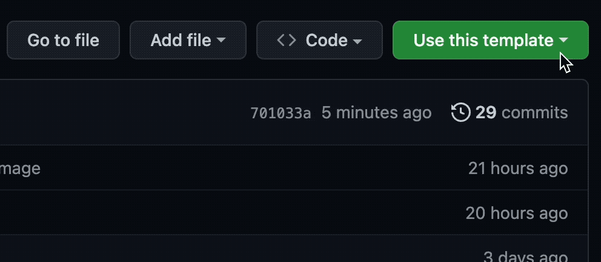

# Codespaces dbt Starter

No install needed, just a GitHub account (and a few spare Codespaces minutes you get for free anyways).

Let's get started!

## Open codespaces (if it isn't already open)
Click "Open on Codespaces", to launch this project into a ready to use web VS-Code version with everything preloaded.

**Make sure to open up the README.md inside Codespaces as well.**

*Notes on codespaces:*

*- If you at any point get an error "The user denied permission to use Service Worker", then you need to enable third-party cookies. [It's a codespaces related problem](https://github.com/orgs/community/discussions/26316).*

*- In our experience, codespaces work best in Chrome or Firefox, not so well in Safari.*

*- Files in codespaces autosave! No need to save anything.*

[Codespaces Documentation](https://docs.github.com/en/codespaces/setting-up-your-project-for-codespaces/adding-a-dev-container-configuration/setting-up-your-python-project-for-codespaces)
